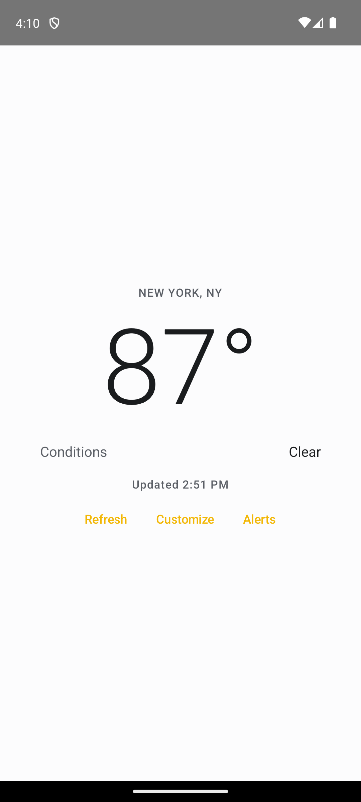
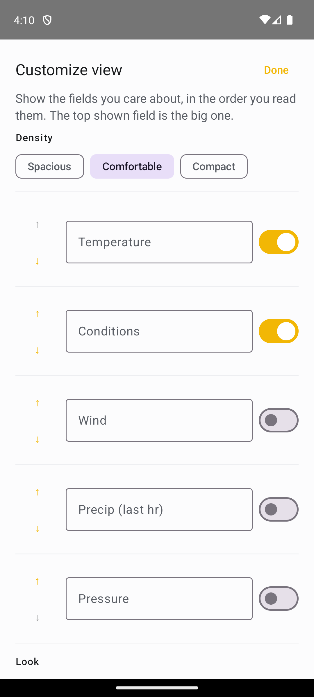
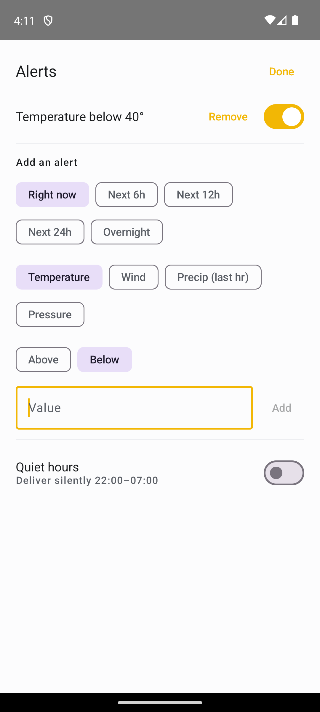

# Just My Weather

[](https://github.com/jimbottle/just-my-weather/actions/workflows/ci.yml)

A weather app that shows you exactly what you care about, arranged exactly how
you want it, alerts you on exactly the conditions you choose, and nothing else.

Most weather apps decide for you — ten-day forecasts, radar, air quality, pollen,
UV, hourly scrubbers — then bury the one number you opened the app to check. Just
My Weather inverts that. The default is quiet and sparse. The power is letting you
build your own view and your own alerts, and editing everything else away.

It's the personal-alerting sibling to a hazard-alert weather app: same underlying
[National Weather Service](https://www.weather.gov/documentation/services-web-api)
data, different intent. One watches for danger; this one watches for whatever
*you* tell it to.

## A look

| The calm default | Build your own view | Your own alerts |
|:---:|:---:|:---:|
|  |  |  |
| One glance answers "what's it like now." | Pick the fields, order, density, and theme. | Rule-based, quiet by default, with quiet hours. |

## Status

Pre-1.0, but the core product is in place:

- ✅ Project scaffold (Kotlin · Jetpack Compose · Material 3 · single module)
- ✅ Weather data layer over the free NWS API (no API key), ported from a
  battle-tested reference — retries, unit conversion, fully unit-tested; the
  grid resolution is cached across launches
- ✅ The default minimalist home view: location · big temperature · one line of
  conditions
- ✅ View customization — pick which data points show, reorder them (the top one
  is the hero), relabel them, choose a density (spacious ↔ compact), and theme
  it (light/dark/system · accent · typeface)
- ✅ Personal rule-based alerting — thresholds on current conditions *and* the
  forecast ("overnight low below 35°", "chance of rain above 50% within 12h"),
  quiet by default, fires once per onset, with optional quiet hours
- ⏳ Custom quiet-hours window, per-rule tone/snooze, configurable cadence

See the issue tracker (beads) for the live plan.

## Build & run

Requires **JDK 17+** and the **Android SDK**. Point Gradle at your SDK:

```bash
echo "sdk.dir=$HOME/Library/Android/sdk" > local.properties   # adjust path
./gradlew :app:assembleDebug          # build
./gradlew :app:testDebugUnitTest      # run unit tests
scripts/hooks/install.sh              # optional: install the pre-commit gate
```

Install the debug APK on a device/emulator:

```bash
./gradlew :app:installDebug
```

## Contributing

This app is built to be forked. The code aims to be easy to read and easy to
change: adding a data point, an alert subject, or a theme should be obvious, not
surgery. See **[CONTRIBUTING.md](CONTRIBUTING.md)** for the build/test gate and
workflow, **[docs/architecture.md](docs/architecture.md)** for the map, and
**[docs/extending.md](docs/extending.md)** for step-by-step recipes for the
common extension points.

## Data & privacy

Weather comes from the public US National Weather Service API — no key, no
account, US coverage. Location is **coarse** and optional (the platform location
provider, not Google Play Services); you can also set a place by hand. Personal
alerts are evaluated and delivered on-device.

## License

Licensed under the [Apache License 2.0](LICENSE) — fork it, ship it, build on
it. See [NOTICE](NOTICE) for attribution.
